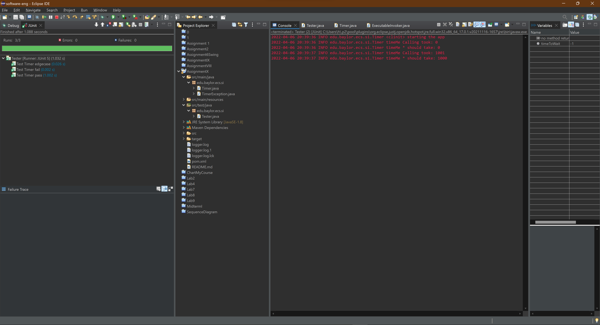

Tasks to answer in your own README.md that you submit on Canvas:

1.  See logger.log, why is it different from the log to console?

Logger logs everything, not specifically what we specify it to. The logger can be configured in terms of verbosity.

2.  Where does this line come from? FINER org.junit.jupiter.engine.execution.ConditionEvaluator logResult Evaluation of condition [org.junit.jupiter.engine.extension.DisabledCondition] resulted in: ConditionEvaluationResult [enabled = true, reason = '@Disabled is not present']

This line comes from the failOverTest(), when the assertThrows method is called.

3.  What does Assertions.assertThrows do?

It asserts that calling a specific method throws an exception. If it does not throw the exception, it fails the assertion.

4.  See TimerException and there are 3 questions
    1.  What is serialVersionUID and why do we need it? (please read on Internet)
   
	serialVersionUID is a unique identifier for a version of a class. It is used when serializing a class, to ensure that the classes are in synchronization.
	
    2.  Why do we need to override constructors?

	For this, we need to override the constructor in order to call the super() constructor, which would initialize all the data to sane values. If we didn't override the TimerException(String) constructor, it wouldn't know to call the super(String) constructor.

    3.  Why we did not override other Exception methods?
    
	We didn't need to override other methods because we didn't need to augment their functionality.	

5.  The Timer.java has a static block static {}, what does it do? (determine when called by debugger)
	
	It instantiates log parameters, including what to log (read from the log configuration file.

6.  What is README.md file format how is it related to bitbucket? (https://confluence.atlassian.com/bitbucketserver/markdown-syntax-guide-776639995.html)

	The README.md is a markdown-formatted file containing important information about a project. Traditionally, it is used in Git repos to describe the project.

7.  Why is the test failing? what do we need to change in Timer? (fix that all tests pass and describe the issue)

	The test was failing because method() was being called with the -1 parameter. You cannot sleep for a negative amount of time. We need to change method to only be called if timeToWait >= 0

8.  What is the actual issue here, what is the sequence of Exceptions and handlers (debug)
	
	The sleep exception is being thrown instead of the TimerException. As a result, the assertion fails, because a different exception is being thrown.

9.  Make a printScreen of your eclipse JUnit5 plugin run (JUnit window at the bottom panel) 
10.  Make a printScreen of your eclipse Maven test run, with console

My image of both 9 and 10 is 

11.  What category of Exceptions is TimerException and what is NullPointerException

Both of these are unchecked exceptions.

12.  Push the updated/fixed source code to your own repository.
	Done
